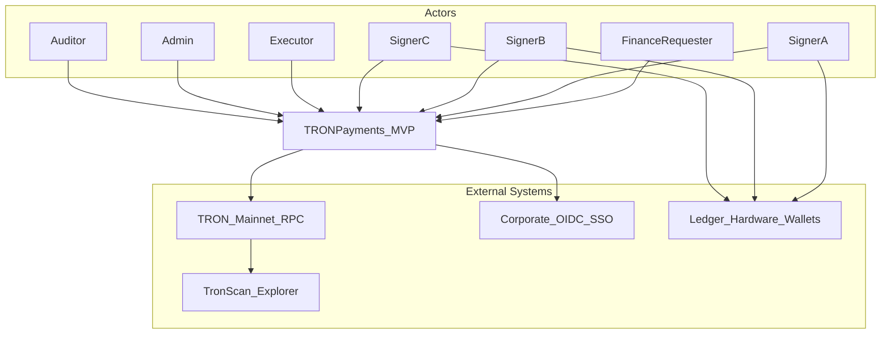
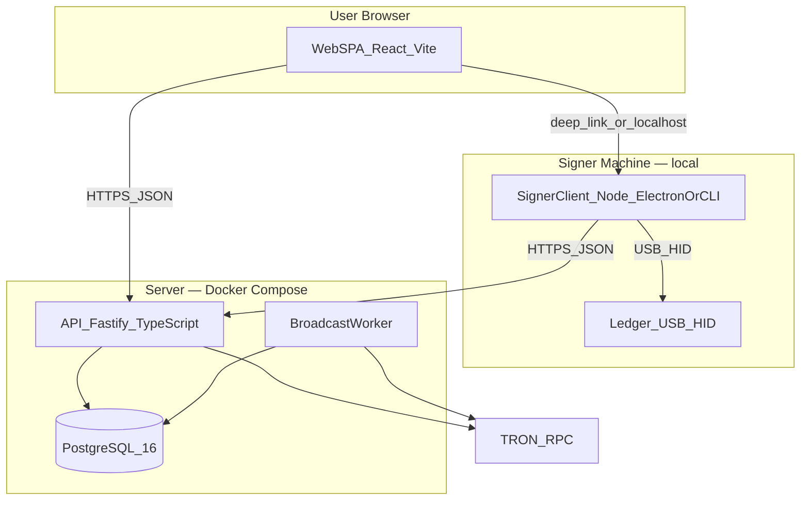

# TRON Payments — System Architecture (C4)

**Status:** living document  
**Owner:** Finance / Engineering  
**Last reviewed:** 2026-08-19

Canonical C4 architecture reference for the TRON multisig 2-of-3 USDT treasury MVP. AI agents and human contributors must read this before changing system boundaries, adding containers, or introducing new cross-cutting flows.

**Related docs:**

| Document | Role |
|---|---|
| [`.kiro/steering/project-bible.md`](../.kiro/steering/project-bible.md) | Product rules, security invariants, domain model |
| [`AGENTS.md`](../AGENTS.md) | Agent setup, devbox commands, quick reference |
| [`docs/threat-model.md`](./threat-model.md) | Threat analysis (to be completed) |

**Decision hierarchy:**

1. Production runtime and applied migrations
2. Security invariants (bible §2)
3. Project Bible
4. **This document**
5. Feature specs, source code

---

## C1 — System Context

Internal corporate tool for remote **2-of-3 multisig USDT TRC-20 payments** from a TRON treasury address. Three finance operators use Ledger hardware wallets to sign; a central backend coordinates requests, verifies signatures, and broadcasts.

### Actors

| Actor | Description |
|---|---|
| **Finance Requester** | Creates USDT payment requests |
| **Signer A / B / C** | Reviews and signs with personal Ledger |
| **Executor** | Triggers broadcast after threshold (may overlap with signers) |
| **Admin** | User management, app configuration |
| **Auditor** | Read-only access to requests and audit trail |

### System Context Diagram



### External Systems

| System | Relationship | Notes |
|---|---|---|
| **TRON Mainnet RPC** | Read/write node access | Permissions, balances, sign weight, broadcast |
| **TronScan** | Read-only explorer links | Post-broadcast confirmation URLs |
| **Corporate OIDC** | Authentication (or email+TOTP for MVP) | No seed-based auth |
| **Ledger devices** | Signing hardware | Accessed only by local signer client via USB/HID |

---

## C2 — Containers



### Container Inventory

| Container | Technology | Responsibility |
|---|---|---|
| **Web SPA** | React 18, TypeScript, Vite | Dashboard, request forms, signing queue, audit views |
| **API Server** | Fastify, TypeScript, Drizzle | Auth, RBAC, request lifecycle, tx builder, signature verifier, config validation |
| **Signer Client** | Node/Electron or CLI | Local Ledger interaction, payload re-validation, signature submission |
| **PostgreSQL** | Postgres 16 | Payment requests, signatures, audit events, job queue |
| **Broadcast Worker** | Node process (in API or separate) | Idempotent broadcast, confirmation polling |

### Forbidden

- Backend or Web UI accessing Ledger hardware
- Private keys anywhere in the system
- Browser-based Ledger signing (WebHID in remote/hosted SPA)
- Arbitrary smart contract calls
- Standalone key management service

---

## C3 — Component Map

### API (`apps/api`)

```text
src/
├── server.ts              # Fastify bootstrap
├── config/                # Env validation, treasury config
├── routes/
│   ├── auth.ts
│   ├── config.ts
│   ├── payment-requests.ts
│   ├── signatures.ts
│   ├── broadcast.ts
│   ├── treasury.ts
│   ├── audit.ts
│   └── health.ts
├── services/
│   ├── payment-request.service.ts
│   ├── transaction-builder.service.ts
│   ├── signature-verifier.service.ts
│   ├── permission-verifier.service.ts
│   ├── broadcast.service.ts
│   ├── audit.service.ts
│   └── tron-rpc.service.ts
├── db/
│   ├── schema/            # Drizzle tables
│   └── migrations/
└── workers/
    └── broadcast.worker.ts
```

### Web (`apps/web`)

```text
src/
├── pages/
│   ├── Dashboard.tsx
│   ├── NewPaymentRequest.tsx
│   ├── PaymentRequestDetail.tsx
│   ├── SigningQueue.tsx
│   ├── TreasuryHealth.tsx
│   └── AuditLog.tsx
├── components/
├── hooks/
├── services/              # API client
└── lib/
```

### Signer (`apps/signer`)

```text
src/
├── cli.ts or main.ts      # Entry point
├── ledger/
│   ├── transport.ts       # WebHID / node-hid
│   ├── tron-signer.ts     # @ledgerhq/hw-app-trx
│   └── device-errors.ts
├── validation/
│   └── payload-validator.ts
├── api-client.ts
└── review-ui.ts           # Full-screen terminal or Electron window
```

### Shared (`packages/shared`)

```text
src/
├── types/                 # PaymentRequest, Signature, roles, statuses
├── canonical/             # Deterministic digest serialization + hash
├── tron/                  # Address validation, amount conversion, TRC-20 encode
├── state-machine/         # Payment request status transitions
└── constants.ts           # Allowed operations, network IDs
```

---

## C4 — Domain Flows

### Payment Request Creation

```text
Requester → Web UI form
  → POST /api/payment-requests
  → API validates address, amount, policy
  → API reads on-chain USDT balance + permissions
  → TransactionBuilder creates USDT transfer tx
  → Store canonical payload + raw_data_hex + txID
  → Status: AWAITING_SIGNATURES
  → AuditEvent: REQUEST_CREATED
```

### Ledger Signing

```text
Signer → Web UI checkbox + "Sign with Ledger"
  → POST /api/payment-requests/:id/signing-session (one-time token)
  → Web opens local signer client (localhost:3847 or custom protocol)
  → Signer GET /api/payment-requests/:id/signing-payload
  → Local validation + full-screen review
  → Ledger signs raw transaction bytes
  → Local signature recovery check
  → POST /api/payment-requests/:id/signatures
  → API verifies ECDSA + getSignWeight
  → Status: PARTIALLY_SIGNED or READY_TO_BROADCAST
  → AuditEvent: SIGNATURE_ADDED
```

### Broadcast

```text
Executor → Web UI final confirmation
  → POST /api/payment-requests/:id/broadcast
  → API re-validates: status, expiration, signatures, weight, permissions, balance
  → broadcasttransaction to TRON RPC
  → Status: BROADCASTED
  → Worker polls confirmation
  → Status: CONFIRMED (or BROADCAST_FAILED)
  → AuditEvent: BROADCAST_* 
```

---

## API Endpoints

```text
POST   /api/auth/login
GET    /api/me

GET    /api/config/public
GET    /api/treasury/health
GET    /api/treasury/permissions
GET    /api/treasury/balances

POST   /api/payment-requests
GET    /api/payment-requests
GET    /api/payment-requests/:id
POST   /api/payment-requests/:id/cancel
POST   /api/payment-requests/:id/reject

POST   /api/payment-requests/:id/signing-session
GET    /api/payment-requests/:id/signing-payload
POST   /api/payment-requests/:id/signatures

GET    /api/payment-requests/:id/sign-weight
POST   /api/payment-requests/:id/broadcast

GET    /api/audit-events
GET    /api/audit-events/export

GET    /health/live
GET    /health/ready
GET    /health/tron-rpc
```

---

## Where to Put New Code

| Feature | Frontend | Backend | Shared | DB |
|---|---|---|---|---|
| New page | `apps/web/src/pages/` | — | — | — |
| API endpoint | — | `apps/api/src/routes/` | — | migration if needed |
| Business logic | `apps/web/src/services/` | `apps/api/src/services/` | `packages/shared/` | — |
| TRON encoding | — | uses shared | `packages/shared/src/tron/` | — |
| Ledger interaction | — | **never** | — | — |
| Ledger interaction | `apps/signer/src/ledger/` | — | — | — |
| State machine | — | uses shared | `packages/shared/src/state-machine/` | — |
| Audit | — | `apps/api/src/services/audit.service.ts` | — | `audit_events` table |
| Schema change | — | — | — | `apps/api/src/db/migrations/` append-only |

---

## Architecture Change Checklist

```text
[ ] User explicitly approved architecture change
[ ] docs/architecture.md updated
[ ] project-bible.md updated if invariants changed
[ ] .cursor/rules/architecture-c4.mdc updated if guardrails changed
[ ] No private keys introduced anywhere
[ ] Ledger access remains local-only in apps/signer
[ ] Canonical payload schema change has migration plan
[ ] Audit events for new mutating operations
[ ] Tests for new behavior
[ ] .env.example updated
```
